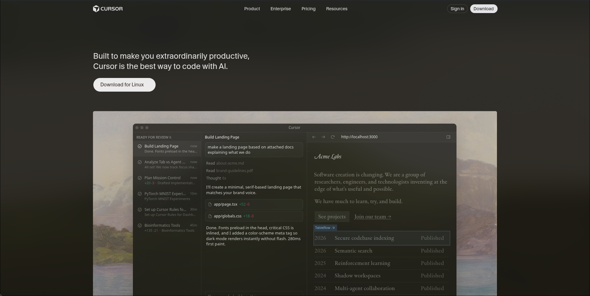

# Dev Tool Landing Page - Cursor

Recreate a desktop-first developer tool landing page inspired by the Cursor website.
[[check here]] :: [live preview](https://cursor-clone.shyamhz.dev/)

[[Screenshot]] :: 

### Recreated sections

1. Top Navigation Bar

    - Logo, nav links, primary CTA

    - Dark background

2. Hero Section

    - Main headline, description, CTA

3. Trusted By / Logos

    - Row of company logos

4. Feature Sections (3 blocks)

    - Two-column layout (text + image)

    - Alternate image/text positions

5. Testimonials

    - Quote cards with name and role

6. Use Cases / Stories

    - Cards with image + short text

8. Changelog / Updates

    - List of updates with date

9. Team / About

    - Large image + short description + CTA

10. Recent Highlights

    - 3 Blog entry

11. Final CTA

    - Big heading + single button

11. Footer

     - Multi-column links and company info
